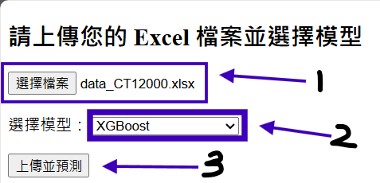

<div align="center" id="top"> 

</div>

<h1 align="center">訂單預測</h1>

<p align="center">
  <a href="#about">About</a> &#xa0; | &#xa0;
  <a href="#features">Features</a> &#xa0; | &#xa0;
  <a href="#technologies">Technologies</a> &#xa0; | &#xa0;
  <a href="#requirements">Requirements</a> &#xa0; | &#xa0;
  <a href="#starting">Starting</a> &#xa0; | &#xa0;
  <a href="https://github.com/martinhsieh586" target="_blank">Author</a>
</p>

***

## About ##

> 通過多種模型預測訂單數量，以期評估生產量是否符合預期。

***

## Features ##

- 模型種類：
  - <a href="./model/arima_model.py">arima</a>
  - <a href="./model/lstm_model.py">LSTM</a>
  - <a href="./model/xgboost_model.py">xgboost</a>
  - <a href="./model/sarima_model.py">sarima</a>
  - <a href="./model/stacking_model.py">stacking</a>
  - <a href="./model/tabnet.py">tabnet</a>
  - <a href="./model/arima-mix-xgboost.py">arima mix xgboost</a>
  - <a href="./model/ETS.py">ETS</a>
- autoML function：
  - 在下拉式選單中選擇 `all model` 選項，會自動找出所有模型中評估出的最佳結果，並將結果顯示在網頁上。
- useage：
  - api：

    ```bash
    # 啟動伺服器
    $ pyhon main.py
    # 開啟網頁 http://localhost:8000/getdata
    # 自動運行並 post data
    ```
  
  - web
  
***

## Requirements ##

```bash
# Clone this project
$ git clone https://github.com/martinhsieh586/tankong_order_predict.git
# create conda environment
$ conda create -n tankong_order_predict python=3.8
# activate conda environment
$ conda activate tankong_order_predict
# install dependencies
$ cd tankong_order_predict
$ pip install -r requirements.txt
```

***

## Starting ##

```bash
# Go to project directory
$ cd tankong_order_predict
# Run the project
$ uvicorn main:app --reload
```

***

### 操作方法 ###

1. 在網頁開啟 `http://localhost:8000/upload` 即可看到畫面
2. 按以下步驟上傳檔案：
   1. 點選 `選擇檔案`
   2. 點選 `選擇模型` 右側下拉式選單
   3. 點選 `上傳並預測`
   
- 資料型態：
  - 訂單資料：`xlsx 檔案`，須包含下列欄位：  
    > `date`：訂單日期  
    > `order`：採購重量

<br> </br>

<a href="#top">Back to top</a>

<!-- use ctrl+shift+V to view this markdown on vscode -->